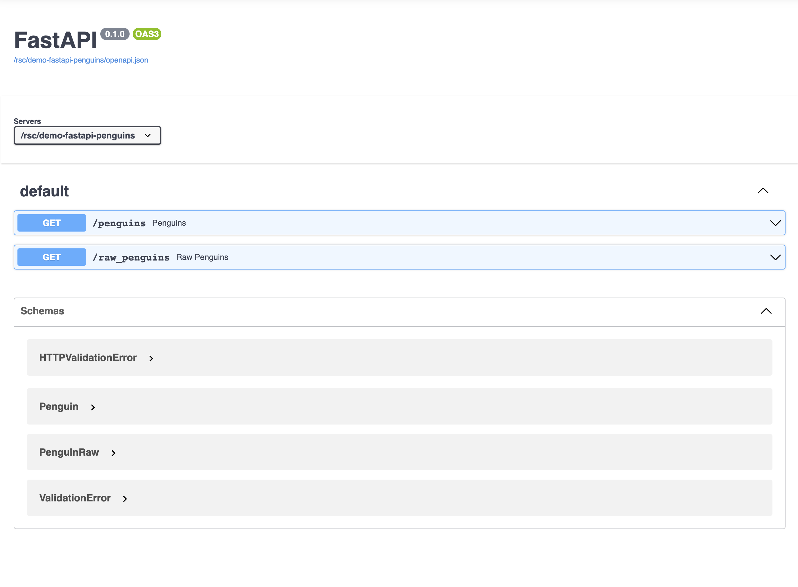

# demo-fastapi-penguins

- Code: <https://github.com/SamEdwardes/demo-fastapi-penguins>
- Deployment: <https://colorado.rstudio.com/rsc/demo-fastapi-penguins/docs>



## Usage

Create a virtual environment.

```bash
uv sync
```

Then run the app.

```bash
uv run uvicorn app:app --reload
```

You could also call the API using `curl`:

```bash
CONNECT_SERVER='https://pub.current.posit.team'

curl -L -X 'GET' \
  "${CONNECT_SERVER}/public/fastapi-penguins/penguins?sample_size=1" \
  -H 'accept: application/json'
```

If the API is private you will need to authenticate using your API key.

```bash
CONNECT_SERVER='https://pub.current.posit.team'

curl -L -X 'GET' \
  "${CONNECT_SERVER}/public/fastapi-penguins/penguins?sample_size=1" \
  -H 'accept: application/json' \
  -H "Authorization: Key ${CONNECT_API_KEY}"
```

Cleaner syntx with httpie:

```bash
uvx --from httpie https pub.current.posit.team/public/fastapi-penguins/penguins \
  "Authorization:Key ${CONNECT_API_KEY}" \
  sample_size==2
```

## Deployment

### Git-backed

The app is automatically deployed to RStudio connect using git backed deployment. Make any changes to the code, then run the following:

```bash
uv run export -o requirements.txt --no-hashes

rsconnect write-manifest fastapi \
  --overwrite \
  --python .venv/bin/python \
  --entrypoint app:app \
  .
```

> ⚠️ Remember to update the app/requirements.txt file if you add any new packages.

### Programmatic

You can deploy the app using the rsconnect cli:

```bash
uv run export -o requirements.txt --no-hashes

rsconnect deploy fastapi \
  --python .venv/bin/python \
  --entrypoint app:app \
  --new \
  .
```
