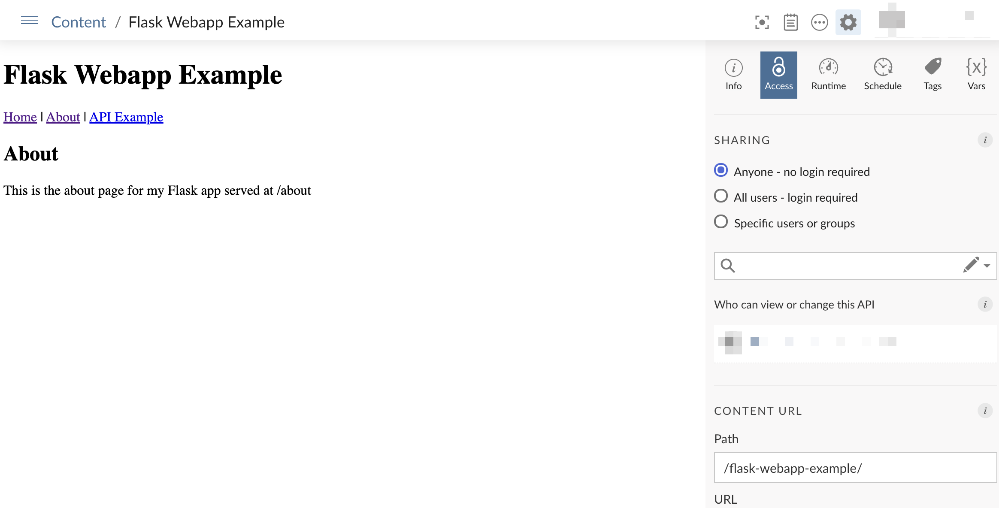
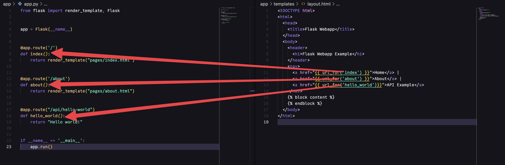

# Flask Webapp

This repo is an example of how to deploy a Flask "Webapp" to Posit Connect. A webapp is very similar to a normal Flask API. The main difference is that it returns HTML instead of JSON.



## Usage

Create a virtual environment.

```bash
python -m venv .venv
source .venv/bin/activate
python -m pip install --upgrade pip wheel setuptools
pip install -r requirements.txt
```

Then run the app.

```bash
flask --debug --app "app/app.py" run
```

## A note on URLs

When you deploy content to Connect, it is not hosted at the root URL. Say for example, your Connect servers URL is `https://colorado.posit.co/rsc`. When you deploy a new item of content, it will be deployed to a URL with a new random identifier, for example: `https://colorado.posit.co/rsc/connect/#/apps/0e4a7469-4d3e-4609-86f1-a4dc1e9db103`.

You need a way to tell Flask to dynamically create the create URL. When using templates to link to a different page, you would normally do this:

```html
<nav>
    <a href="/">Home</a> |
    <a href="/about">About</a> |
    <a href="/api/hello-world">API Example</a>
</nav>
```

When you are running a Flask webapp on Connect, you should use `url_for`. The argument inside `url_for` should be the name of the function that returns the HTML page you desire. For example:

```html
<nav>
    <a href="{{ url_for('index') }}">Home</a> |
    <a href="{{ url_for('about') }}">About</a> |
    <a href="{{ url_for('hello_world')}}">API Example</a>
</nav>
```



## Deployment

### Git-backed

The app is automatically deployed to Posit connect using git backed deployment. Make any changes to the code, then run the following:

```bash
rsconnect write-manifest api \
    --overwrite \
    --python .venv/bin/python \
    --entrypoint app.app:app \
    .
```

> ⚠️ Remember to update the app/requirements.txt file if you add any new packages.

### Programmatic

You can deploy the app using the rsconnect cli:

```bash
rsconnect deploy api \
    --title "Flask Webapp Example" \
    --entrypoint "app.app:app" \
    --python ".venv/bin/python" \
    .
```
