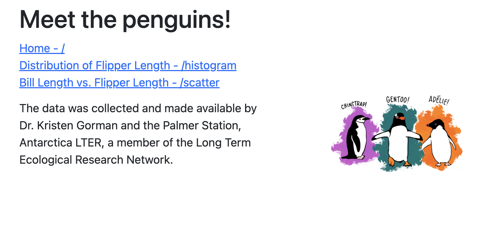

# demo-dash-multi-page-penguins with Dash Pages



- Source code: <https://github.com/SamEdwardes/demo-dash-multi-page-penguins>
- Connect deployment: <https://colorado.rstudio.com/rsc/demo-dash-multi-page-penguins/>

## Usage

Create a new virtual environment:

```bash
python -m venv venv
source venv/bin/activate
python -m pip install --upgrade pip wheel
pip install -requirements.txt
```

The run the app:

```bash
python app.py
```

## Deployment

### Git-backed

The app is automatically deployed to RStudio connect using git backed deployment. Make any changes to the code, then run the following:

```bash
rsconnect write-manifest dash \
  --overwrite \
  --python venv/bin/python \
  --entrypoint app \
  .
```

> ⚠️ Remember to update the app/requirements.txt file if you add any new packages.

### Programmatic

You can deploy the app using the rsconnect cli:

```bash
 rsconnect deploy dash \
  --python venv/bin/python \
  --entrypoint app:app \
  .
```
