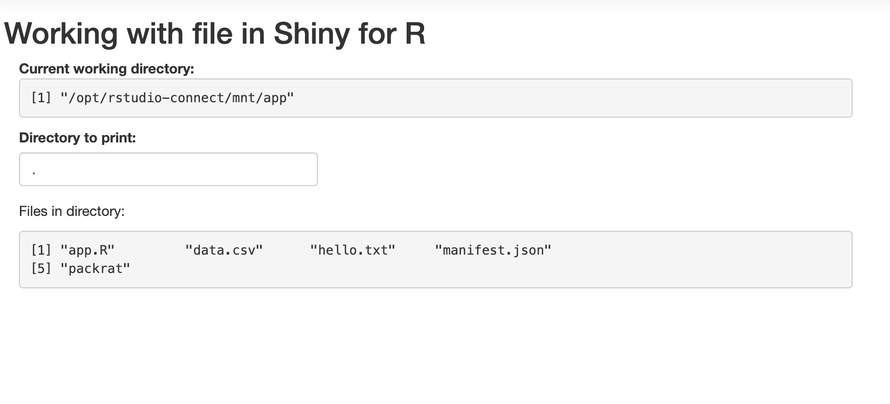

# Shiny for R - Working with Files

An app to explore how files are handled with Shiny apps on Connect.



## Deploy

To deploy this app to Connect, you can use the following command:

```r
rsconnect::writeManifest()
```
