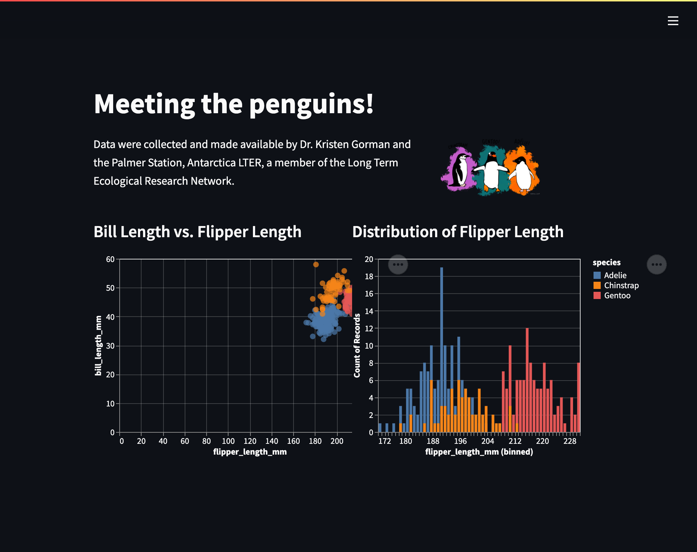

# demo-streamlit-penguins

- Code: <https://github.com/SamEdwardes/demo-streamlit-penguins>
- Deployment: <https://colorado.rstudio.com/rsc/demo-streamlit-penguins/>



## Usaage

Create a virtual environment and install dependencies.

```bash
uv sync
```

Then run the app.

```bash
uv run streamlit run app.py
```

## Deployment

Ensure that  the requirements.txt is in sync with the lockfile.

```bash
uv export -o requirements.txt --no-hashes --no-dev
```

### Git-backed deploy

The app is automatically deployed to RStudio connect using git backed deployment. Make any changes to the code, then run the following:

```bash
uv run rsconnect write-manifest streamlit --overwrite .
```

### Programatic deploy

You can deploy the app using the rsconnect cli:

```bash
uv run rsconnect deploy streamlit --new .
```
