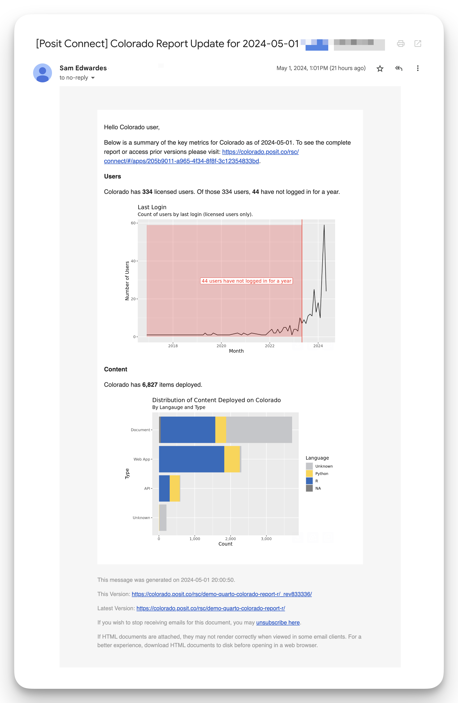
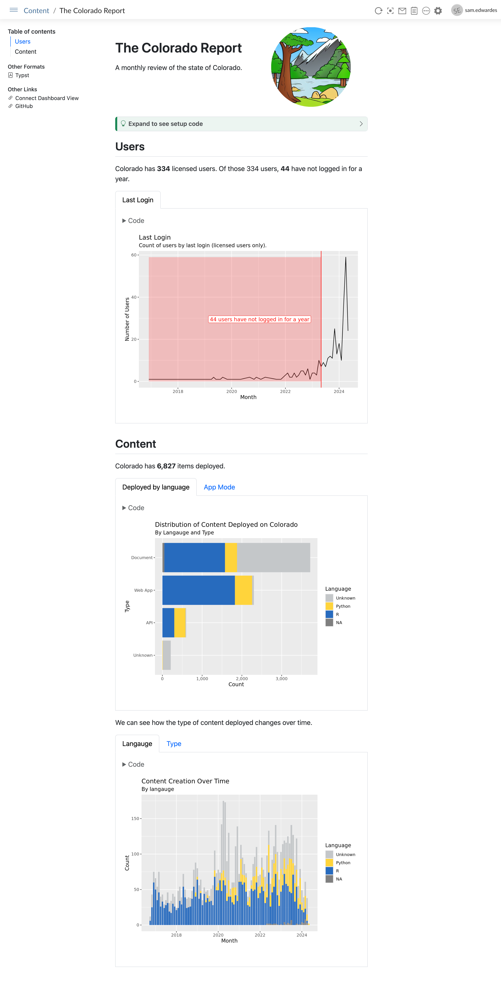

# The Colorado Report

## Git backed publishing

```r
rsconnect::writeManifest(
  appDir = ".",
  appPrimaryDoc = "colorado-report.qmd",
  quarto = quarto::quarto_path()
)
```

## Screenshot of email output



## Screenshot of Posit Connect output


